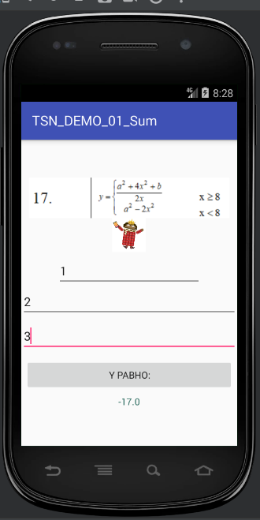
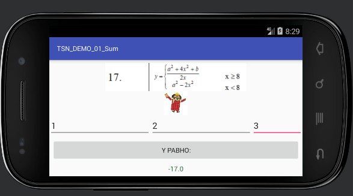
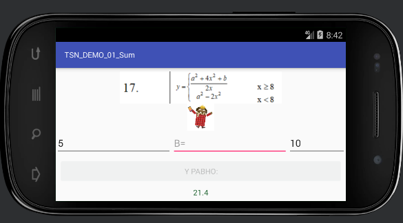

# TSN_ANDROID_DEMO_HELLO
Простейшая программа суммы двух цифр на Android

На следующих двух скриншотах видно выполнение заданий 1-3
1) Необходимо выполнить задание №1 с использованием 2-х разметок: горизонтальной и вертикальной:
- вертикальная разметка должна состоять из линейной вертикальной разметки с вложенной
  горизонтальной разметкой;
- горизонтальная разметка должна состоять из табличной разметки
2) Программа должна восстанавливать данные при переворачивании экрана
3) В программе должна отображаться картинка с заданием

4) Необходимо программно блокировать кнопку расчета при невведенных данных

https://www.youtube.com/watch?v=PMYmKEhbh0s
